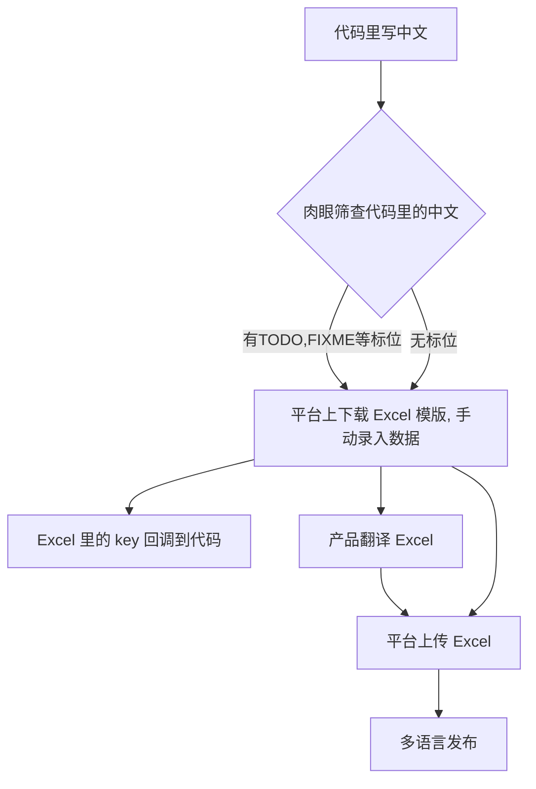
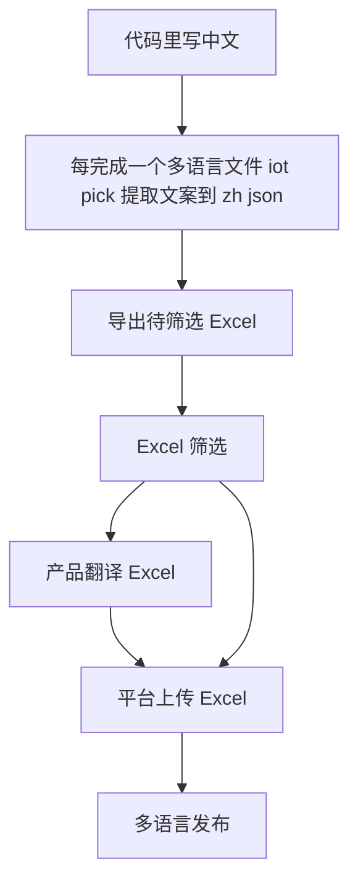
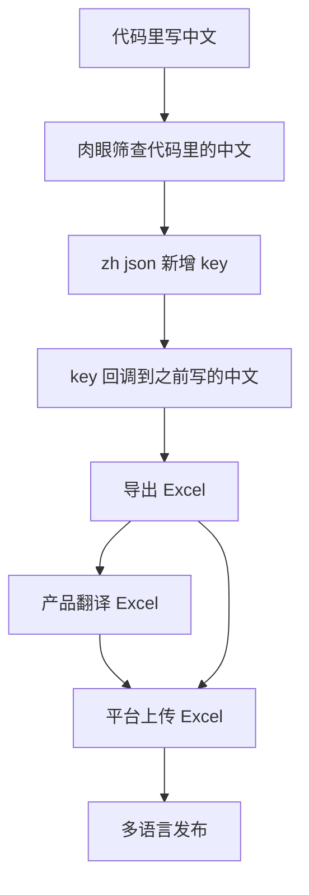
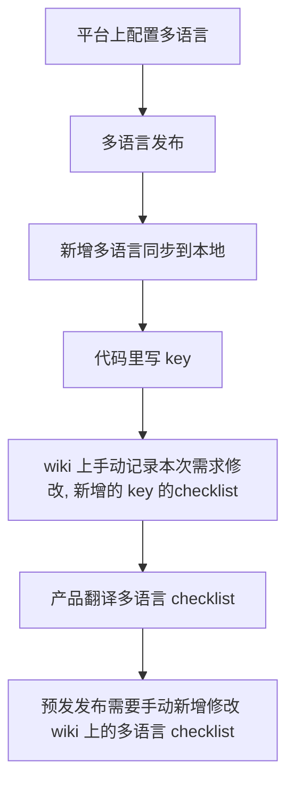
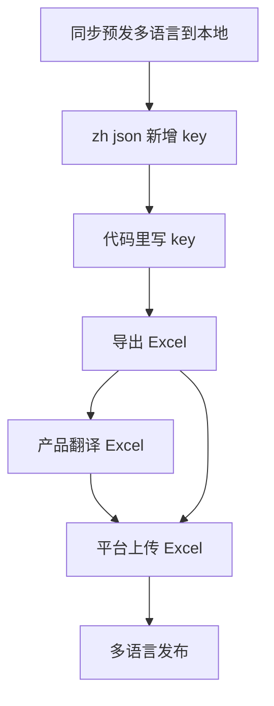
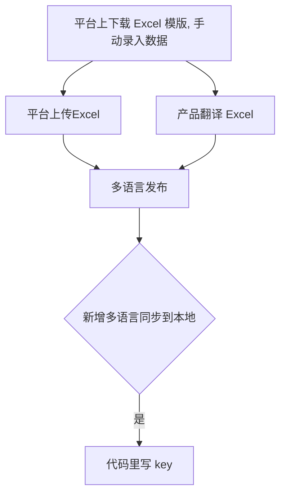
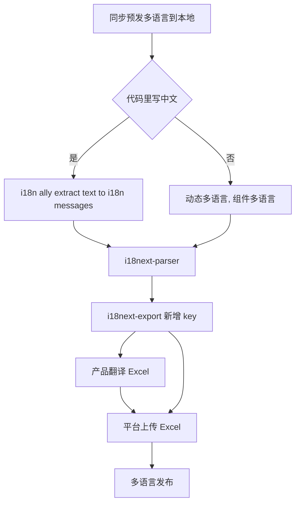

title: i18next
speaker: 杜甫
plugins:
    - echarts
    - mermaid

<slide class="bg-black-blue aligncenter" image="https://source.unsplash.com/C1HhAQrbykQ/ .dark">

# i18next {.text-landing.text-shadow}

By 杜甫 {.text-intro}

<slide class="bg-black-blue aligncenter">

# 多语言更新现状 {.text-landing.text-shadow}

<slide class="bg-black-blue aligncenter">

# 代码里直接写中文 {.text-landing.text-shadow}

<slide class="bg-white aligncenter">

<slide class="bg-white aligncenter">

<slide class="bg-white aligncenter">

<slide class="bg-black-blue aligncenter">

# 代码里直接写key {.text-landing.text-shadow}

<slide class="bg-white aligncenter">

<slide class="bg-white aligncenter">

<slide class="bg-white aligncenter">

<slide class="bg-black-blue aligncenter">

# 我认为的多语言更新最佳实践 {.text-landing.text-shadow}

<slide class="bg-white aligncenter">

